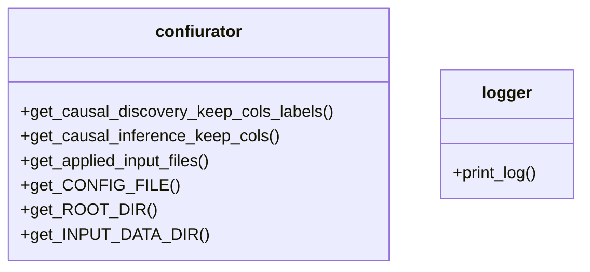
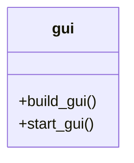
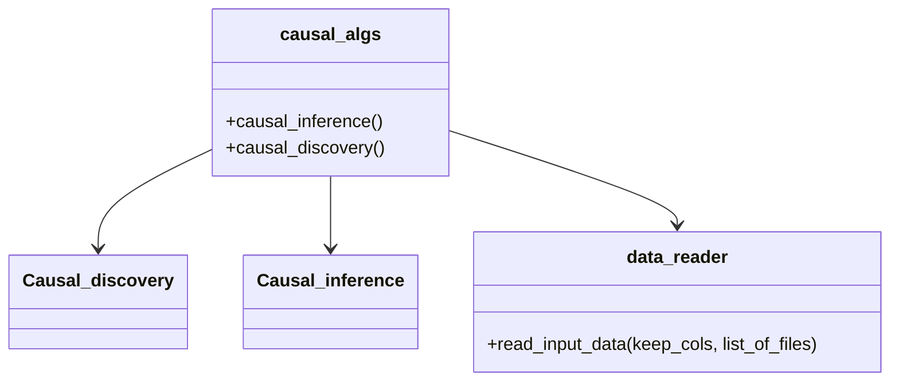
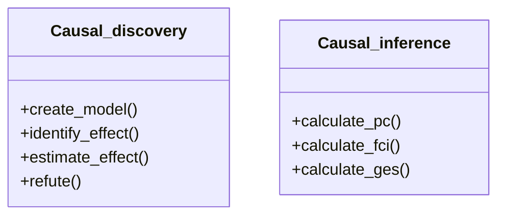

# Table of Contents

- [Table of Contents](#table-of-contents)
  - [Classes](#classes)
    - [Singleton classes](#singleton-classes)
    - [Main classes](#main-classes)
    - [Main business logic](#main-business-logic)
    - [Main causality logics](#main-causality-logics)
  - [Conver non-binary data to binary for causal discovery:](#conver-non-binary-data-to-binary-for-causal-discovery)
  - [Print the correlation line in case of causal inference:](#print-the-correlation-line-in-case-of-causal-inference)

## Classes

[Tutorial](https://mermaid.js.org/syntax/classDiagram.html)

### Singleton classes

These are frequently used, therefore singletons.
**TODO:** logger::print_log is static, because the class constructor needs some special parameter.



### Main classes

**gui**

* created in the main and holds the gui objects
* creates the logger, because logger needs the gui and the text box on it



### Main business logic

**causal_algs**

* has no data
* the gui calls it
* responsible for reading the data by data_reader
* responsible to pass the input data to the causal algoritms

**data_reader**

* it is now a simple static method
* does not store any data
* removes the not used columns, keeps only the needed ones
* return a pandas framework



### Main causality logics

**Causal_discovery**

* has no data
* the gui calls it
* responsible for reading the data by data_reader
* responsible to pass the input data to the causal algoritms

**Causal_inference**

* it is now a simple static method
* does not store any data
* removes the not used columns, keeps only the needed ones
* return a pandas framework



---

## Conver non-binary data to binary for causal discovery:

```
# Convert to binary format a non-binary data
# (Actually patternDel will be kept and not deleted)
patternDel = "Diesel|Otto"
filter = df['motor működési mód'].str.contains(patternDel) == False
df = df[~filter]

df['motor működési mód'].replace("Diesel", 0, inplace=True)
df['motor működési mód'].replace("Otto", 1, inplace=True)

print("\nSize of the input data: " +
      str(df.shape[0]) + "x" + str(df.shape[1]) + "\n\nAnd the input data:\n")
print(df)
```

## Print the correlation line in case of causal inference:

```
scatter_plot_with_correlation_line(df['teljesítmény'], df["CO2 kibocsátás gkm V7"])
```
